# Claude Code - 类图、流程图与时序图

> 使用 Mermaid 语法绘制，可在 GitHub / VS Code / 任何支持 Mermaid 的 Markdown 渲染器中查看。

---

## 目录

1. [核心类图 - Tool 系统](#1-核心类图---tool-系统)
2. [核心类图 - QueryEngine 与 Agentic Loop](#2-核心类图---queryengine-与-agentic-loop)
3. [核心类图 - AppState 状态模型](#3-核心类图---appstate-状态模型)
4. [核心类图 - MCP 连接状态机](#4-核心类图---mcp-连接状态机)
5. [核心类图 - Memory 记忆系统](#5-核心类图---memory-记忆系统)
6. [核心类图 - StreamingToolExecutor](#6-核心类图---streamingtoolexecutor)
7. [流程图 - 应用启动流程](#7-流程图---应用启动流程)
8. [流程图 - Agentic Loop 主循环](#8-流程图---agentic-loop-主循环)
9. [流程图 - 工具执行流水线](#9-流程图---工具执行流水线)
10. [流程图 - 权限检查](#10-流程图---权限检查)
11. [流程图 - 上下文压缩策略](#11-流程图---上下文压缩策略)
12. [时序图 - 完整请求-响应周期](#12-时序图---完整请求-响应周期)
13. [时序图 - 子 Agent 生成与协调](#13-时序图---子-agent-生成与协调)
14. [时序图 - MCP 工具调用](#14-时序图---mcp-工具调用)
15. [组件关系总览图](#15-组件关系总览图)

---

## 1. 核心类图 - Tool 系统

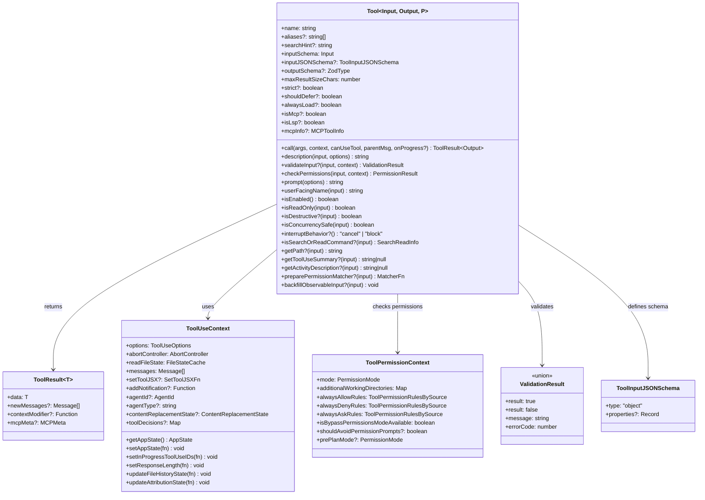
```mermaid
classDiagram
    class Tool~Input, Output, P~ {
        +name: string
        +aliases?: string[]
        +searchHint?: string
        +inputSchema: Input
        +inputJSONSchema?: ToolInputJSONSchema
        +outputSchema?: ZodType
        +maxResultSizeChars: number
        +strict?: boolean
        +shouldDefer?: boolean
        +alwaysLoad?: boolean
        +isMcp?: boolean
        +isLsp?: boolean
        +mcpInfo?: MCPToolInfo
        +call(args, context, canUseTool, parentMsg, onProgress?) ToolResult~Output~
        +description(input, options) string
        +validateInput?(input, context) ValidationResult
        +checkPermissions(input, context) PermissionResult
        +prompt(options) string
        +userFacingName(input) string
        +isEnabled() boolean
        +isReadOnly(input) boolean
        +isDestructive?(input) boolean
        +isConcurrencySafe(input) boolean
        +interruptBehavior?() "cancel" | "block"
        +isSearchOrReadCommand?(input) SearchReadInfo
        +getPath?(input) string
        +getToolUseSummary?(input) string|null
        +getActivityDescription?(input) string|null
        +preparePermissionMatcher?(input) MatcherFn
        +backfillObservableInput?(input) void
    }

    class ToolResult~T~ {
        +data: T
        +newMessages?: Message[]
        +contextModifier?: Function
        +mcpMeta?: MCPMeta
    }

    class ToolUseContext {
        +options: ToolUseOptions
        +abortController: AbortController
        +readFileState: FileStateCache
        +messages: Message[]
        +getAppState() AppState
        +setAppState(fn) void
        +setToolJSX?: SetToolJSXFn
        +addNotification?: Function
        +setInProgressToolUseIDs(fn) void
        +setResponseLength(fn) void
        +updateFileHistoryState(fn) void
        +updateAttributionState(fn) void
        +agentId?: AgentId
        +agentType?: string
        +contentReplacementState?: ContentReplacementState
        +toolDecisions?: Map
    }

    class ToolPermissionContext {
        +mode: PermissionMode
        +additionalWorkingDirectories: Map
        +alwaysAllowRules: ToolPermissionRulesBySource
        +alwaysDenyRules: ToolPermissionRulesBySource
        +alwaysAskRules: ToolPermissionRulesBySource
        +isBypassPermissionsModeAvailable: boolean
        +shouldAvoidPermissionPrompts?: boolean
        +prePlanMode?: PermissionMode
    }

    class ValidationResult {
        <<union>>
        +result: true
        +result: false
        +message: string
        +errorCode: number
    }

    class ToolInputJSONSchema {
        +type: "object"
        +properties?: Record
    }

    Tool --> ToolResult : returns
    Tool --> ToolUseContext : uses
    Tool --> ToolPermissionContext : checks permissions
    Tool --> ValidationResult : validates
    Tool --> ToolInputJSONSchema : defines schema
```

### 工具实现继承关系

```mermaid
classDiagram
    class Tool {
        <<interface>>
        +name: string
        +call()
        +checkPermissions()
        +isEnabled()
    }

    class BashTool {
        +name = "Bash"
        +call() 执行 Shell 命令
    }
    class FileReadTool {
        +name = "Read"
        +call() 读取文件
    }
    class FileEditTool {
        +name = "Edit"
        +call() 编辑文件
    }
    class FileWriteTool {
        +name = "Write"
        +call() 写入文件
    }
    class GlobTool {
        +name = "Glob"
        +call() 文件模式搜索
    }
    class GrepTool {
        +name = "Grep"
        +call() 内容搜索
    }
    class AgentTool {
        +name = "Agent"
        +call() 生成子 Agent
    }
    class SkillTool {
        +name = "Skill"
        +call() 执行技能
    }
    class MCPTool {
        +name = "mcp__*"
        +isMcp = true
        +call() 调用 MCP 服务器
    }
    class WebFetchTool {
        +name = "WebFetch"
        +call() 获取 URL 内容
    }
    class WebSearchTool {
        +name = "WebSearch"
        +call() Web 搜索
    }
    class TaskCreateTool {
        +name = "TaskCreate"
        +call() 创建任务
    }
    class LSPTool {
        +name = "LSP"
        +call() LSP 操作
    }
    class NotebookEditTool {
        +name = "NotebookEdit"
        +call() 编辑 Jupyter
    }
    class EnterPlanModeTool {
        +name = "EnterPlanMode"
        +call() 进入计划模式
    }
    class EnterWorktreeTool {
        +name = "EnterWorktree"
        +call() 进入 Worktree
    }
    class ToolSearchTool {
        +name = "ToolSearch"
        +call() 搜索可用工具
    }
    class AskUserQuestionTool {
        +name = "AskUserQuestion"
        +call() 向用户提问
    }

    Tool <|.. BashTool
    Tool <|.. FileReadTool
    Tool <|.. FileEditTool
    Tool <|.. FileWriteTool
    Tool <|.. GlobTool
    Tool <|.. GrepTool
    Tool <|.. AgentTool
    Tool <|.. SkillTool
    Tool <|.. MCPTool
    Tool <|.. WebFetchTool
    Tool <|.. WebSearchTool
    Tool <|.. TaskCreateTool
    Tool <|.. LSPTool
    Tool <|.. NotebookEditTool
    Tool <|.. EnterPlanModeTool
    Tool <|.. EnterWorktreeTool
    Tool <|.. ToolSearchTool
    Tool <|.. AskUserQuestionTool
```

---

## 2. 核心类图 - QueryEngine 与 Agentic Loop

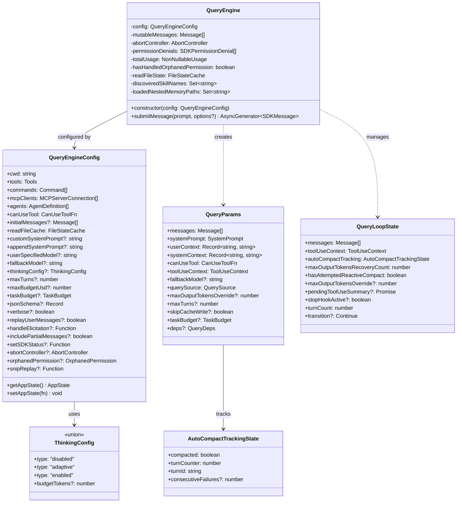
```mermaid
classDiagram
    class QueryEngine {
        -config: QueryEngineConfig
        -mutableMessages: Message[]
        -abortController: AbortController
        -permissionDenials: SDKPermissionDenial[]
        -totalUsage: NonNullableUsage
        -hasHandledOrphanedPermission: boolean
        -readFileState: FileStateCache
        -discoveredSkillNames: Set~string~
        -loadedNestedMemoryPaths: Set~string~
        +constructor(config: QueryEngineConfig)
        +submitMessage(prompt, options?) AsyncGenerator~SDKMessage~
    }

    class QueryEngineConfig {
        +cwd: string
        +tools: Tools
        +commands: Command[]
        +mcpClients: MCPServerConnection[]
        +agents: AgentDefinition[]
        +canUseTool: CanUseToolFn
        +getAppState() AppState
        +setAppState(fn) void
        +initialMessages?: Message[]
        +readFileCache: FileStateCache
        +customSystemPrompt?: string
        +appendSystemPrompt?: string
        +userSpecifiedModel?: string
        +fallbackModel?: string
        +thinkingConfig?: ThinkingConfig
        +maxTurns?: number
        +maxBudgetUsd?: number
        +taskBudget?: TaskBudget
        +jsonSchema?: Record
        +verbose?: boolean
        +replayUserMessages?: boolean
        +handleElicitation?: Function
        +includePartialMessages?: boolean
        +setSDKStatus?: Function
        +abortController?: AbortController
        +orphanedPermission?: OrphanedPermission
        +snipReplay?: Function
    }

    class QueryParams {
        +messages: Message[]
        +systemPrompt: SystemPrompt
        +userContext: Record~string, string~
        +systemContext: Record~string, string~
        +canUseTool: CanUseToolFn
        +toolUseContext: ToolUseContext
        +fallbackModel?: string
        +querySource: QuerySource
        +maxOutputTokensOverride?: number
        +maxTurns?: number
        +skipCacheWrite?: boolean
        +taskBudget?: TaskBudget
        +deps?: QueryDeps
    }

    class QueryLoopState {
        +messages: Message[]
        +toolUseContext: ToolUseContext
        +autoCompactTracking: AutoCompactTrackingState
        +maxOutputTokensRecoveryCount: number
        +hasAttemptedReactiveCompact: boolean
        +maxOutputTokensOverride?: number
        +pendingToolUseSummary?: Promise
        +stopHookActive?: boolean
        +turnCount: number
        +transition?: Continue
    }

    class AutoCompactTrackingState {
        +compacted: boolean
        +turnCounter: number
        +turnId: string
        +consecutiveFailures?: number
    }

    class ThinkingConfig {
        <<union>>
        +type: "disabled"
        +type: "adaptive"
        +type: "enabled"
        +budgetTokens?: number
    }

    QueryEngine --> QueryEngineConfig : configured by
    QueryEngine ..> QueryParams : creates
    QueryEngine ..> QueryLoopState : manages
    QueryParams --> AutoCompactTrackingState : tracks
    QueryEngineConfig --> ThinkingConfig : uses
```

---

## 3. 核心类图 - AppState 状态模型

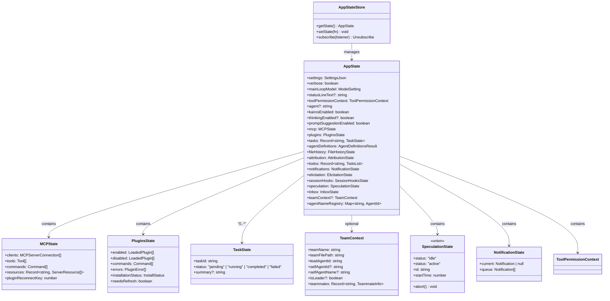
```mermaid
classDiagram
    class AppState {
        +settings: SettingsJson
        +verbose: boolean
        +mainLoopModel: ModelSetting
        +statusLineText?: string
        +toolPermissionContext: ToolPermissionContext
        +agent?: string
        +kairosEnabled: boolean
        +thinkingEnabled?: boolean
        +promptSuggestionEnabled: boolean
        +mcp: MCPState
        +plugins: PluginsState
        +tasks: Record~string, TaskState~
        +agentDefinitions: AgentDefinitionsResult
        +fileHistory: FileHistoryState
        +attribution: AttributionState
        +todos: Record~string, TodoList~
        +notifications: NotificationState
        +elicitation: ElicitationState
        +sessionHooks: SessionHooksState
        +speculation: SpeculationState
        +inbox: InboxState
        +teamContext?: TeamContext
        +agentNameRegistry: Map~string, AgentId~
    }

    class MCPState {
        +clients: MCPServerConnection[]
        +tools: Tool[]
        +commands: Command[]
        +resources: Record~string, ServerResource[]~
        +pluginReconnectKey: number
    }

    class PluginsState {
        +enabled: LoadedPlugin[]
        +disabled: LoadedPlugin[]
        +commands: Command[]
        +errors: PluginError[]
        +installationStatus: InstallStatus
        +needsRefresh: boolean
    }

    class TaskState {
        +taskId: string
        +status: "pending" | "running" | "completed" | "failed"
        +summary?: string
    }

    class TeamContext {
        +teamName: string
        +teamFilePath: string
        +leadAgentId: string
        +selfAgentId?: string
        +selfAgentName?: string
        +isLeader?: boolean
        +teammates: Record~string, TeammateInfo~
    }

    class SpeculationState {
        <<union>>
        +status: "idle"
        +status: "active"
        +id: string
        +abort() void
        +startTime: number
    }

    class NotificationState {
        +current: Notification | null
        +queue: Notification[]
    }

    class AppStateStore {
        +getState() AppState
        +setState(fn) void
        +subscribe(listener) Unsubscribe
    }

    AppState --> MCPState : contains
    AppState --> PluginsState : contains
    AppState --> TaskState : "0..*"
    AppState --> TeamContext : optional
    AppState --> SpeculationState : contains
    AppState --> NotificationState : contains
    AppState --> ToolPermissionContext : contains
    AppStateStore --> AppState : manages
```

---

## 4. 核心类图 - MCP 连接状态机

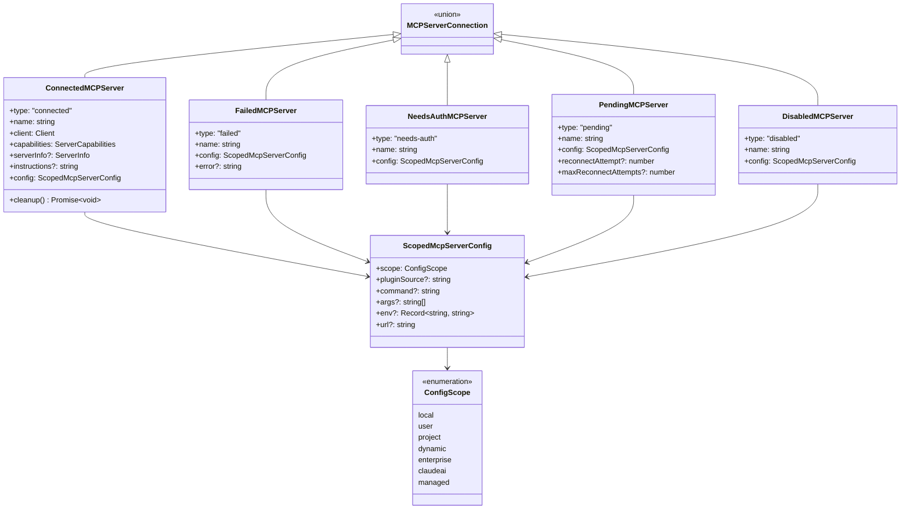
```mermaid
classDiagram
    class MCPServerConnection {
        <<union>>
    }

    class ConnectedMCPServer {
        +type: "connected"
        +name: string
        +client: Client
        +capabilities: ServerCapabilities
        +serverInfo?: ServerInfo
        +instructions?: string
        +config: ScopedMcpServerConfig
        +cleanup() Promise~void~
    }

    class FailedMCPServer {
        +type: "failed"
        +name: string
        +config: ScopedMcpServerConfig
        +error?: string
    }

    class NeedsAuthMCPServer {
        +type: "needs-auth"
        +name: string
        +config: ScopedMcpServerConfig
    }

    class PendingMCPServer {
        +type: "pending"
        +name: string
        +config: ScopedMcpServerConfig
        +reconnectAttempt?: number
        +maxReconnectAttempts?: number
    }

    class DisabledMCPServer {
        +type: "disabled"
        +name: string
        +config: ScopedMcpServerConfig
    }

    class ScopedMcpServerConfig {
        +scope: ConfigScope
        +pluginSource?: string
        +command?: string
        +args?: string[]
        +env?: Record~string, string~
        +url?: string
    }

    class ConfigScope {
        <<enumeration>>
        local
        user
        project
        dynamic
        enterprise
        claudeai
        managed
    }

    MCPServerConnection <|-- ConnectedMCPServer
    MCPServerConnection <|-- FailedMCPServer
    MCPServerConnection <|-- NeedsAuthMCPServer
    MCPServerConnection <|-- PendingMCPServer
    MCPServerConnection <|-- DisabledMCPServer
    ConnectedMCPServer --> ScopedMcpServerConfig
    FailedMCPServer --> ScopedMcpServerConfig
    NeedsAuthMCPServer --> ScopedMcpServerConfig
    PendingMCPServer --> ScopedMcpServerConfig
    DisabledMCPServer --> ScopedMcpServerConfig
    ScopedMcpServerConfig --> ConfigScope
```

### MCP 连接状态转换

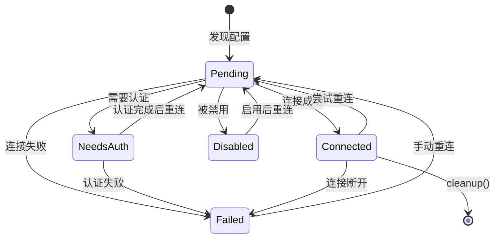
```mermaid
stateDiagram-v2
    [*] --> Pending : 发现配置
    Pending --> Connected : 连接成功
    Pending --> Failed : 连接失败
    Pending --> NeedsAuth : 需要认证
    Pending --> Disabled : 被禁用

    NeedsAuth --> Pending : 认证完成后重连
    NeedsAuth --> Failed : 认证失败

    Connected --> Failed : 连接断开
    Connected --> Pending : 尝试重连

    Failed --> Pending : 手动重连
    Disabled --> Pending : 启用后重连

    Connected --> [*] : cleanup()
```

---

## 5. 核心类图 - Memory 记忆系统

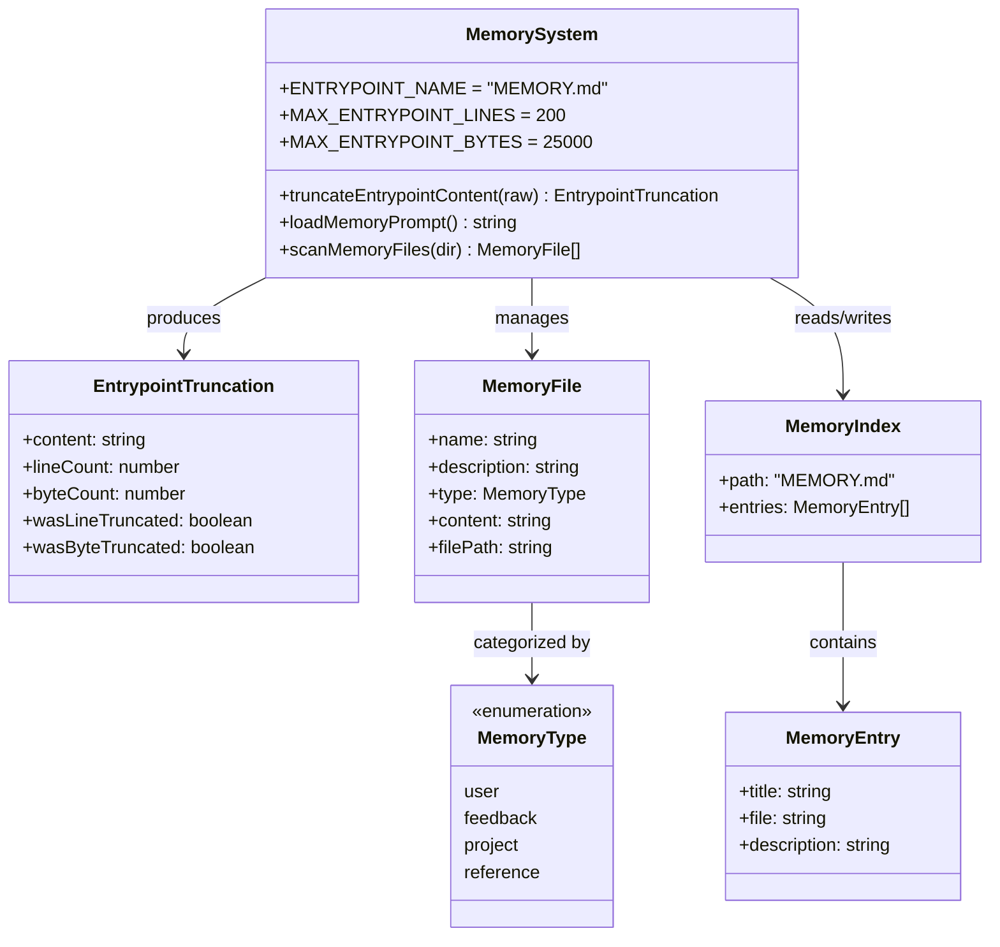
```mermaid
classDiagram
    class MemorySystem {
        +ENTRYPOINT_NAME = "MEMORY.md"
        +MAX_ENTRYPOINT_LINES = 200
        +MAX_ENTRYPOINT_BYTES = 25000
        +truncateEntrypointContent(raw) EntrypointTruncation
        +loadMemoryPrompt() string
        +scanMemoryFiles(dir) MemoryFile[]
    }

    class EntrypointTruncation {
        +content: string
        +lineCount: number
        +byteCount: number
        +wasLineTruncated: boolean
        +wasByteTruncated: boolean
    }

    class MemoryType {
        <<enumeration>>
        user
        feedback
        project
        reference
    }

    class MemoryFile {
        +name: string
        +description: string
        +type: MemoryType
        +content: string
        +filePath: string
    }

    class MemoryIndex {
        +path: "MEMORY.md"
        +entries: MemoryEntry[]
    }

    class MemoryEntry {
        +title: string
        +file: string
        +description: string
    }

    MemorySystem --> EntrypointTruncation : produces
    MemorySystem --> MemoryFile : manages
    MemorySystem --> MemoryIndex : reads/writes
    MemoryFile --> MemoryType : categorized by
    MemoryIndex --> MemoryEntry : contains
```

---

## 6. 核心类图 - StreamingToolExecutor

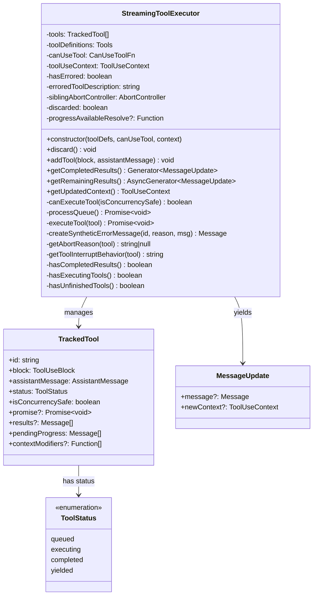
```mermaid
classDiagram
    class StreamingToolExecutor {
        -tools: TrackedTool[]
        -toolDefinitions: Tools
        -canUseTool: CanUseToolFn
        -toolUseContext: ToolUseContext
        -hasErrored: boolean
        -erroredToolDescription: string
        -siblingAbortController: AbortController
        -discarded: boolean
        -progressAvailableResolve?: Function
        +constructor(toolDefs, canUseTool, context)
        +discard() void
        +addTool(block, assistantMessage) void
        +getCompletedResults() Generator~MessageUpdate~
        +getRemainingResults() AsyncGenerator~MessageUpdate~
        +getUpdatedContext() ToolUseContext
        -canExecuteTool(isConcurrencySafe) boolean
        -processQueue() Promise~void~
        -executeTool(tool) Promise~void~
        -createSyntheticErrorMessage(id, reason, msg) Message
        -getAbortReason(tool) string|null
        -getToolInterruptBehavior(tool) string
        -hasCompletedResults() boolean
        -hasExecutingTools() boolean
        -hasUnfinishedTools() boolean
    }

    class TrackedTool {
        +id: string
        +block: ToolUseBlock
        +assistantMessage: AssistantMessage
        +status: ToolStatus
        +isConcurrencySafe: boolean
        +promise?: Promise~void~
        +results?: Message[]
        +pendingProgress: Message[]
        +contextModifiers?: Function[]
    }

    class ToolStatus {
        <<enumeration>>
        queued
        executing
        completed
        yielded
    }

    class MessageUpdate {
        +message?: Message
        +newContext?: ToolUseContext
    }

    StreamingToolExecutor --> TrackedTool : manages
    TrackedTool --> ToolStatus : has status
    StreamingToolExecutor --> MessageUpdate : yields
```

---

## 7. 流程图 - 应用启动流程

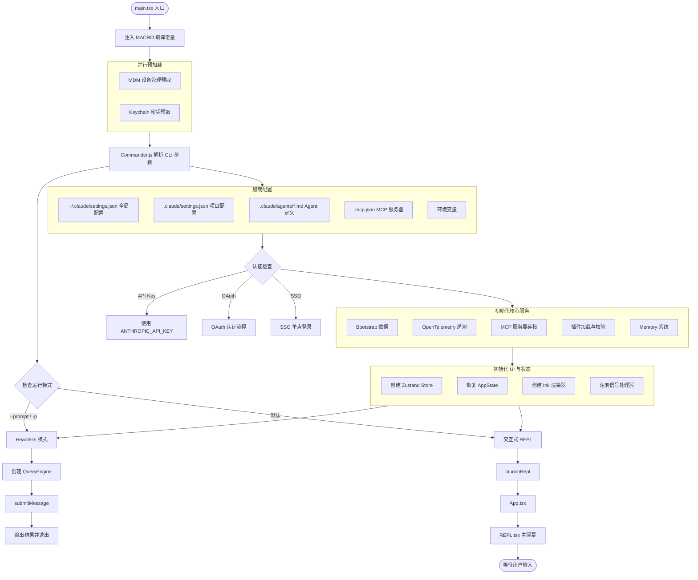
```mermaid
flowchart TD
    START([main.tsx 入口]) --> MACRO[注入 MACRO 编译常量]
    MACRO --> PREFETCH

    subgraph PREFETCH [并行预加载]
        MDM[MDM 设备管理预取]
        KEY[Keychain 密钥预取]
    end

    PREFETCH --> CLI[Commander.js 解析 CLI 参数]

    CLI --> FLAGS{检查运行模式}
    FLAGS -->|--prompt / -p| HEADLESS[Headless 模式]
    FLAGS -->|默认| INTERACTIVE[交互式 REPL]

    subgraph CONFIG [加载配置]
        direction TB
        C1[~/.claude/settings.json 全局配置]
        C2[.claude/settings.json 项目配置]
        C3[.claude/agents/*.md Agent 定义]
        C4[.mcp.json MCP 服务器]
        C5[环境变量]
    end

    CLI --> CONFIG

    CONFIG --> AUTH{认证检查}
    AUTH -->|API Key| APIKEY[使用 ANTHROPIC_API_KEY]
    AUTH -->|OAuth| OAUTH[OAuth 认证流程]
    AUTH -->|SSO| SSO[SSO 单点登录]

    AUTH --> INIT_SERVICES

    subgraph INIT_SERVICES [初始化核心服务]
        direction TB
        S1[Bootstrap 数据]
        S2[OpenTelemetry 遥测]
        S3[MCP 服务器连接]
        S4[插件加载与校验]
        S5[Memory 系统]
    end

    INIT_SERVICES --> INIT_UI

    subgraph INIT_UI [初始化 UI 与状态]
        direction TB
        U1[创建 Zustand Store]
        U2[恢复 AppState]
        U3[创建 Ink 渲染器]
        U4[注册信号处理器]
    end

    INIT_UI --> HEADLESS
    INIT_UI --> INTERACTIVE

    HEADLESS --> QUERY_ENGINE[创建 QueryEngine]
    QUERY_ENGINE --> SUBMIT[submitMessage]
    SUBMIT --> OUTPUT[输出结果并退出]

    INTERACTIVE --> REPL[launchRepl]
    REPL --> APP[App.tsx]
    APP --> REPL_SCREEN[REPL.tsx 主屏幕]
    REPL_SCREEN --> WAIT_INPUT([等待用户输入])
```

---

## 8. 流程图 - Agentic Loop 主循环

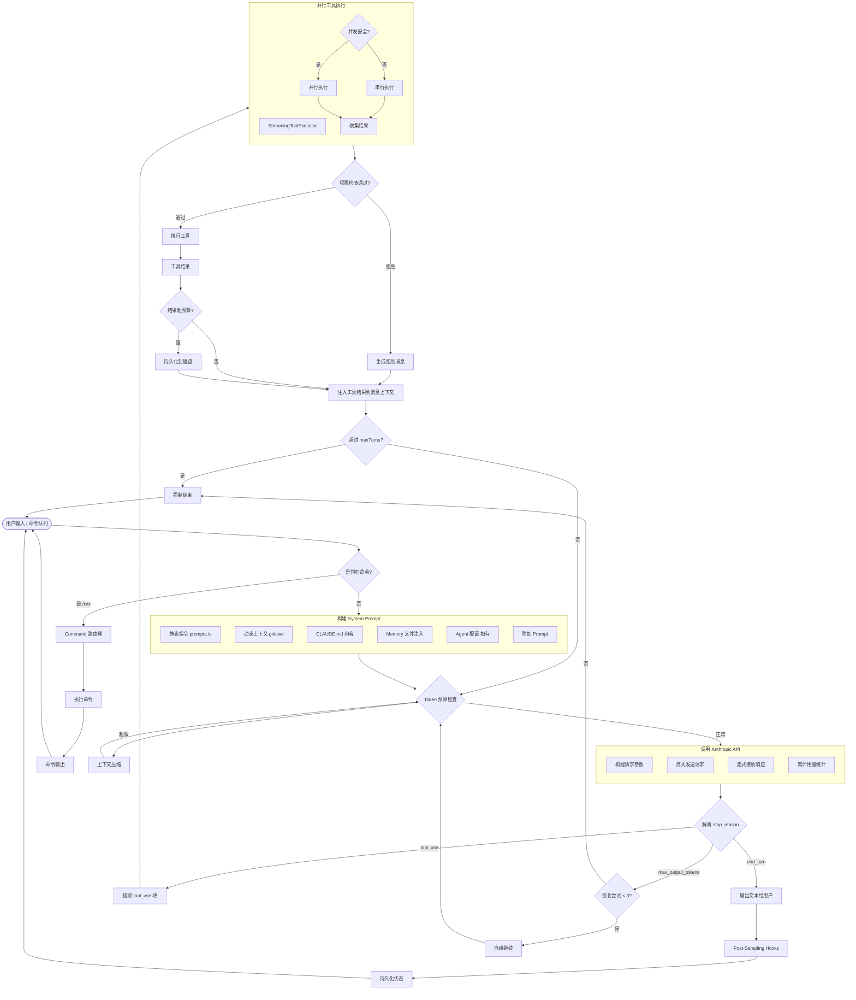
```mermaid
flowchart TD
    INPUT([用户输入 / 命令队列]) --> IS_COMMAND{是斜杠命令?}

    IS_COMMAND -->|是 /xxx| CMD_ROUTE[Command 路由器]
    CMD_ROUTE --> CMD_EXEC[执行命令]
    CMD_EXEC --> CMD_OUT[命令输出]
    CMD_OUT --> INPUT

    IS_COMMAND -->|否| BUILD_PROMPT

    subgraph BUILD_PROMPT [构建 System Prompt]
        direction TB
        BP1[静态指令 prompts.ts]
        BP2[动态上下文 git/cwd]
        BP3[CLAUDE.md 内容]
        BP4[Memory 文件注入]
        BP5[Agent 配置 如有]
        BP6[附加 Prompt]
    end

    BUILD_PROMPT --> TOKEN_CHECK{Token 预算检查}

    TOKEN_CHECK -->|超限| COMPACT[上下文压缩]
    COMPACT --> TOKEN_CHECK
    TOKEN_CHECK -->|正常| API_CALL

    subgraph API_CALL [调用 Anthropic API]
        direction TB
        A1[构建请求参数]
        A2[流式发送请求]
        A3[流式接收响应]
        A4[累计用量统计]
    end

    API_CALL --> PARSE_RESP{解析 stop_reason}

    PARSE_RESP -->|end_turn| END_TURN[输出文本给用户]
    END_TURN --> POST[Post-Sampling Hooks]
    POST --> PERSIST[持久化状态]
    PERSIST --> INPUT

    PARSE_RESP -->|tool_use| EXTRACT[提取 tool_use 块]

    EXTRACT --> TOOL_EXEC

    subgraph TOOL_EXEC [并行工具执行]
        direction TB
        TE1[StreamingToolExecutor]
        TE2{并发安全?}
        TE2 -->|是| PARA[并行执行]
        TE2 -->|否| SEQ[串行执行]
        PARA --> COLLECT[收集结果]
        SEQ --> COLLECT
    end

    TOOL_EXEC --> PERM_CHECK{权限检查通过?}
    PERM_CHECK -->|拒绝| DENY_MSG[生成拒绝消息]
    PERM_CHECK -->|通过| EXEC_TOOL[执行工具]

    DENY_MSG --> INJECT
    EXEC_TOOL --> RESULT[工具结果]
    RESULT --> BUDGET{结果超预算?}
    BUDGET -->|是| PERSIST_DISK[持久化到磁盘]
    BUDGET -->|否| INJECT
    PERSIST_DISK --> INJECT

    INJECT[注入工具结果到消息上下文] --> TURN_CHECK{超过 maxTurns?}
    TURN_CHECK -->|是| FORCE_END[强制结束]
    TURN_CHECK -->|否| TOKEN_CHECK

    PARSE_RESP -->|max_output_tokens| RECOVERY{恢复尝试 < 3?}
    RECOVERY -->|是| CONTINUE[自动继续]
    RECOVERY -->|否| FORCE_END
    CONTINUE --> TOKEN_CHECK

    FORCE_END --> INPUT
```

---

## 9. 流程图 - 工具执行流水线

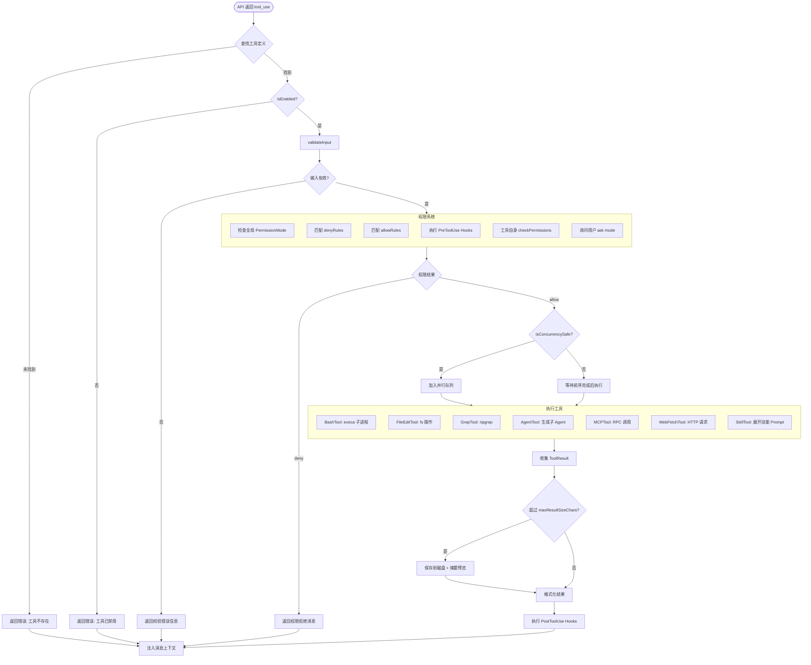
```mermaid
flowchart TD
    TOOL_CALL([API 返回 tool_use]) --> FIND{查找工具定义}

    FIND -->|未找到| NOT_FOUND[返回错误: 工具不存在]
    FIND -->|找到| ENABLED{isEnabled?}

    ENABLED -->|否| DISABLED[返回错误: 工具已禁用]
    ENABLED -->|是| VALIDATE[validateInput]

    VALIDATE --> VALID{输入有效?}
    VALID -->|否| INVALID[返回校验错误信息]
    VALID -->|是| PERM

    subgraph PERM [权限系统]
        direction TB
        P1[检查全局 PermissionMode]
        P2[匹配 denyRules]
        P3[匹配 allowRules]
        P4[执行 PreToolUse Hooks]
        P5[工具自身 checkPermissions]
        P6[询问用户 ask mode]
    end

    PERM --> PERM_RESULT{权限结果}
    PERM_RESULT -->|deny| DENIED[返回权限拒绝消息]
    PERM_RESULT -->|allow| CONCURRENT{isConcurrencySafe?}

    CONCURRENT -->|是| PARALLEL[加入并行队列]
    CONCURRENT -->|否| SERIAL[等待前序完成后执行]

    PARALLEL --> EXECUTE
    SERIAL --> EXECUTE

    subgraph EXECUTE [执行工具]
        direction TB
        E1[BashTool: execa 子进程]
        E2[FileEditTool: fs 操作]
        E3[GrepTool: ripgrep]
        E4[AgentTool: 生成子 Agent]
        E5[MCPTool: RPC 调用]
        E6[WebFetchTool: HTTP 请求]
        E7[SkillTool: 展开技能 Prompt]
    end

    EXECUTE --> RESULT[收集 ToolResult]

    RESULT --> SIZE_CHECK{超过 maxResultSizeChars?}
    SIZE_CHECK -->|是| PERSIST[保存到磁盘 + 摘要预览]
    SIZE_CHECK -->|否| FORMAT

    PERSIST --> FORMAT[格式化结果]
    FORMAT --> POST_HOOKS[执行 PostToolUse Hooks]
    POST_HOOKS --> INJECT[注入消息上下文]

    NOT_FOUND --> INJECT
    DISABLED --> INJECT
    INVALID --> INJECT
    DENIED --> INJECT
```

---

## 10. 流程图 - 权限检查

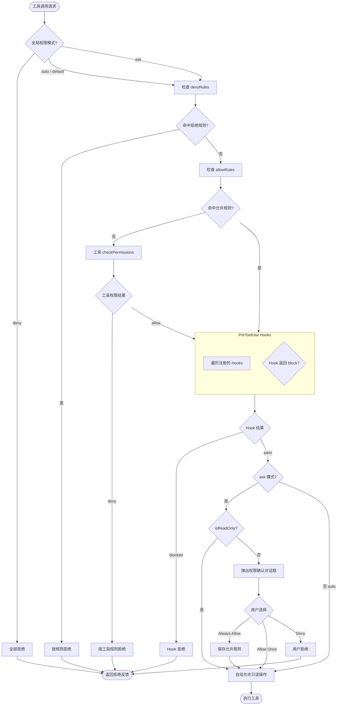
```mermaid
flowchart TD
    REQ([工具调用请求]) --> MODE{全局权限模式?}

    MODE -->|deny| DENY_ALL[全部拒绝]

    MODE -->|auto / default| CHECK_DENY[检查 denyRules]
    MODE -->|ask| CHECK_DENY

    CHECK_DENY --> DENY_MATCH{命中拒绝规则?}
    DENY_MATCH -->|是| DENY_RULE[按规则拒绝]

    DENY_MATCH -->|否| CHECK_ALLOW[检查 allowRules]
    CHECK_ALLOW --> ALLOW_MATCH{命中允许规则?}

    ALLOW_MATCH -->|是| PRE_HOOK

    ALLOW_MATCH -->|否| TOOL_PERM[工具 checkPermissions]
    TOOL_PERM --> TOOL_RESULT{工具权限结果}

    TOOL_RESULT -->|allow| PRE_HOOK
    TOOL_RESULT -->|deny| DENY_TOOL[按工具规则拒绝]

    subgraph PRE_HOOK [PreToolUse Hooks]
        direction TB
        H1[遍历注册的 Hooks]
        H2{Hook 返回 block?}
    end

    PRE_HOOK --> HOOK_RESULT{Hook 结果}
    HOOK_RESULT -->|blocked| DENY_HOOK[Hook 拒绝]

    HOOK_RESULT -->|pass| IS_ASK{ask 模式?}

    IS_ASK -->|是| READONLY{isReadOnly?}
    READONLY -->|是| ALLOW[自动允许只读操作]
    READONLY -->|否| PROMPT[弹出权限确认对话框]

    PROMPT --> USER{用户选择}
    USER -->|Always Allow| SAVE_ALLOW[保存允许规则]
    USER -->|Allow Once| ALLOW
    USER -->|Deny| DENY_USER[用户拒绝]

    IS_ASK -->|否 auto| ALLOW

    SAVE_ALLOW --> ALLOW

    ALLOW --> EXECUTE([执行工具])

    DENY_ALL --> FEEDBACK([返回拒绝反馈])
    DENY_RULE --> FEEDBACK
    DENY_TOOL --> FEEDBACK
    DENY_HOOK --> FEEDBACK
    DENY_USER --> FEEDBACK
```

---

## 11. 流程图 - 上下文压缩策略

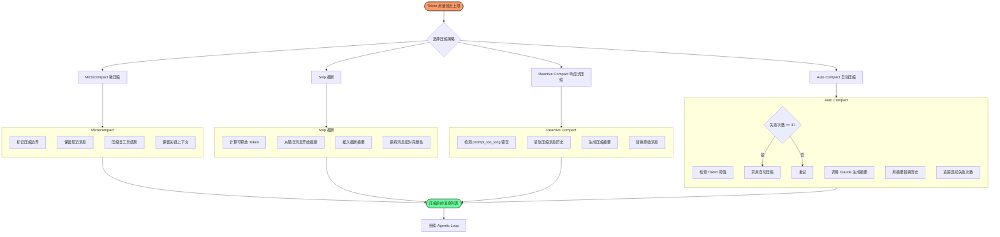
```mermaid
flowchart TD
    TRIGGER([Token 用量接近上限]) --> STRATEGY{选择压缩策略}

    STRATEGY --> MICRO[Microcompact 微压缩]
    STRATEGY --> SNIP[Snip 截断]
    STRATEGY --> REACTIVE[Reactive Compact 响应式压缩]
    STRATEGY --> AUTO[Auto Compact 自动压缩]

    subgraph MICRO_DETAIL [Microcompact]
        direction TB
        M1[标记压缩边界]
        M2[保留最近消息]
        M3[压缩旧工具结果]
        M4[保留关键上下文]
    end

    subgraph SNIP_DETAIL [Snip 截断]
        direction TB
        S1[计算可释放 Token]
        S2[从最旧消息开始截断]
        S3[插入截断摘要]
        S4[保持消息配对完整性]
    end

    subgraph REACTIVE_DETAIL [Reactive Compact]
        direction TB
        R1[检测 prompt_too_long 错误]
        R2[紧急压缩消息历史]
        R3[生成压缩摘要]
        R4[替换原始消息]
    end

    subgraph AUTO_DETAIL [Auto Compact]
        direction TB
        A1[检查 Token 阈值]
        A2[调用 Claude 生成摘要]
        A3[用摘要替换历史]
        A4[追踪连续失败次数]
        A5{失败次数 >= 3?}
        A5 -->|是| A6[禁用自动压缩]
        A5 -->|否| A7[重试]
    end

    MICRO --> MICRO_DETAIL
    SNIP --> SNIP_DETAIL
    REACTIVE --> REACTIVE_DETAIL
    AUTO --> AUTO_DETAIL

    MICRO_DETAIL --> RESULT
    SNIP_DETAIL --> RESULT
    REACTIVE_DETAIL --> RESULT
    AUTO_DETAIL --> RESULT

    RESULT([压缩后的消息列表]) --> CONTINUE[继续 Agentic Loop]

    style TRIGGER fill:#f96,stroke:#333
    style RESULT fill:#6f9,stroke:#333
```

---

## 12. 时序图 - 完整请求-响应周期

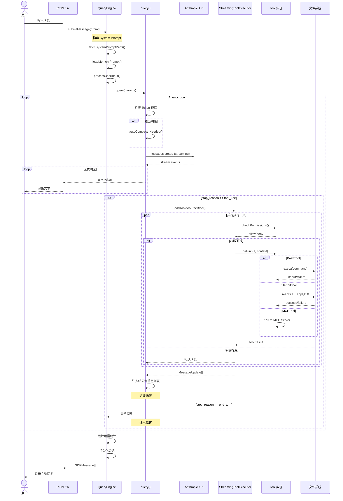
```mermaid
sequenceDiagram
    actor User as 用户
    participant REPL as REPL.tsx
    participant QE as QueryEngine
    participant Q as query()
    participant API as Anthropic API
    participant STE as StreamingToolExecutor
    participant Tool as Tool 实现
    participant FS as 文件系统

    User->>REPL: 输入消息
    REPL->>QE: submitMessage(prompt)

    Note over QE: 构建 System Prompt
    QE->>QE: fetchSystemPromptParts()
    QE->>QE: loadMemoryPrompt()
    QE->>QE: processUserInput()

    QE->>Q: query(params)

    loop Agentic Loop
        Q->>Q: 检查 Token 预算
        alt 超出阈值
            Q->>Q: autoCompactIfNeeded()
        end

        Q->>API: messages.create (streaming)
        API-->>Q: stream events

        loop 流式响应
            Q-->>REPL: 文本 token
            REPL-->>User: 渲染文本
        end

        alt stop_reason == tool_use
            Q->>STE: addTool(toolUseBlock)

            par 并行执行工具
                STE->>Tool: checkPermissions()
                Tool-->>STE: allow/deny

                alt 权限通过
                    STE->>Tool: call(input, context)

                    alt BashTool
                        Tool->>FS: execa(command)
                        FS-->>Tool: stdout/stderr
                    else FileEditTool
                        Tool->>FS: readFile + applyDiff
                        FS-->>Tool: success/failure
                    else MCPTool
                        Tool->>Tool: RPC to MCP Server
                    end

                    Tool-->>STE: ToolResult
                else 权限拒绝
                    STE-->>Q: 拒绝消息
                end
            end

            STE-->>Q: MessageUpdate[]
            Q->>Q: 注入结果到消息列表
            Note over Q: 继续循环
        else stop_reason == end_turn
            Q-->>QE: 最终消息
            Note over Q: 退出循环
        end
    end

    QE->>QE: 累计用量统计
    QE->>QE: 持久化会话
    QE-->>REPL: SDKMessage[]
    REPL-->>User: 显示完整回复
```

---

## 13. 时序图 - 子 Agent 生成与协调

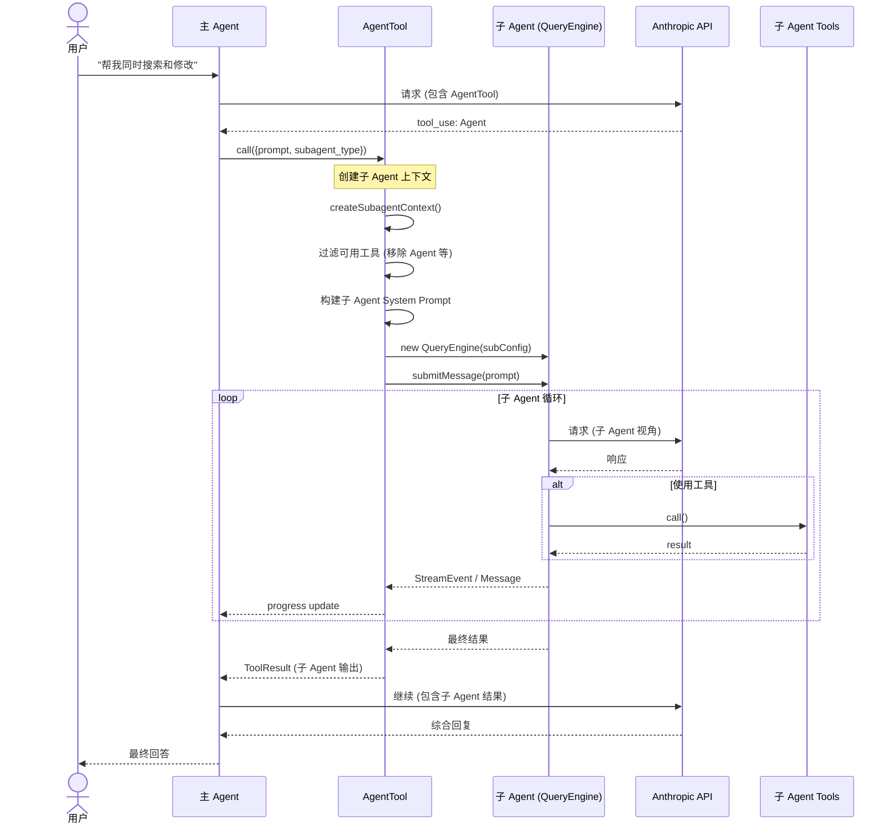
```mermaid
sequenceDiagram
    actor User as 用户
    participant Main as 主 Agent
    participant AT as AgentTool
    participant Sub as 子 Agent (QueryEngine)
    participant API as Anthropic API
    participant Tools as 子 Agent Tools

    User->>Main: "帮我同时搜索和修改"

    Main->>API: 请求 (包含 AgentTool)
    API-->>Main: tool_use: Agent

    Main->>AT: call({prompt, subagent_type})

    Note over AT: 创建子 Agent 上下文
    AT->>AT: createSubagentContext()
    AT->>AT: 过滤可用工具 (移除 Agent 等)
    AT->>AT: 构建子 Agent System Prompt

    AT->>Sub: new QueryEngine(subConfig)
    AT->>Sub: submitMessage(prompt)

    loop 子 Agent 循环
        Sub->>API: 请求 (子 Agent 视角)
        API-->>Sub: 响应

        alt 使用工具
            Sub->>Tools: call()
            Tools-->>Sub: result
        end

        Sub-->>AT: StreamEvent / Message
        AT-->>Main: progress update
    end

    Sub-->>AT: 最终结果
    AT-->>Main: ToolResult (子 Agent 输出)

    Main->>API: 继续 (包含子 Agent 结果)
    API-->>Main: 综合回复

    Main-->>User: 最终回答
```

---

## 14. 时序图 - MCP 工具调用

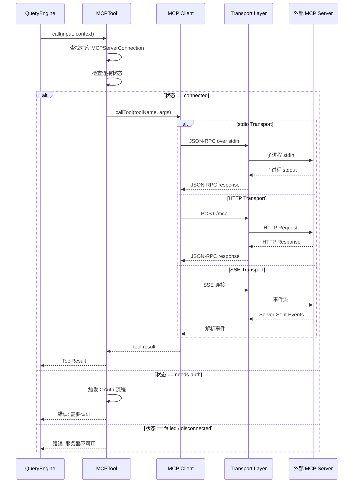
```mermaid
sequenceDiagram
    participant QE as QueryEngine
    participant MCPTool as MCPTool
    participant Client as MCP Client
    participant Transport as Transport Layer
    participant Server as 外部 MCP Server

    QE->>MCPTool: call(input, context)

    MCPTool->>MCPTool: 查找对应 MCPServerConnection
    MCPTool->>MCPTool: 检查连接状态

    alt 状态 == connected
        MCPTool->>Client: callTool(toolName, args)

        alt stdio Transport
            Client->>Transport: JSON-RPC over stdin
            Transport->>Server: 子进程 stdin
            Server-->>Transport: 子进程 stdout
            Transport-->>Client: JSON-RPC response
        else HTTP Transport
            Client->>Transport: POST /mcp
            Transport->>Server: HTTP Request
            Server-->>Transport: HTTP Response
            Transport-->>Client: JSON-RPC response
        else SSE Transport
            Client->>Transport: SSE 连接
            Transport->>Server: 事件流
            Server-->>Transport: Server-Sent Events
            Transport-->>Client: 解析事件
        end

        Client-->>MCPTool: tool result
        MCPTool-->>QE: ToolResult

    else 状态 == needs-auth
        MCPTool->>MCPTool: 触发 OAuth 流程
        MCPTool-->>QE: 错误: 需要认证

    else 状态 == failed / disconnected
        MCPTool-->>QE: 错误: 服务器不可用
    end
```

---

## 15. 组件关系总览图

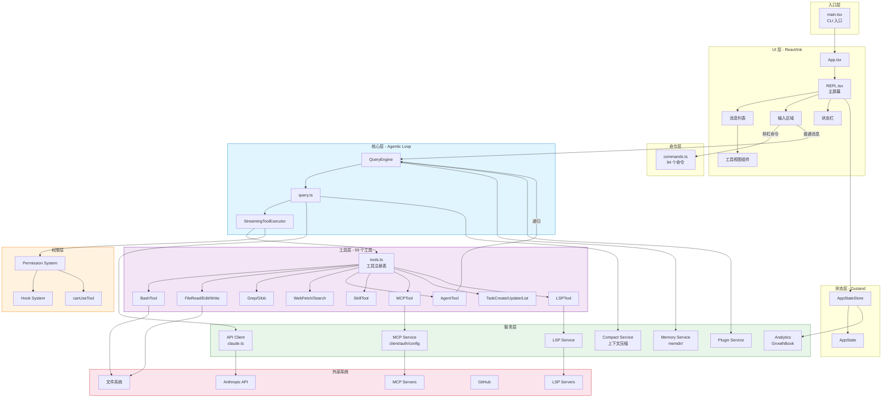
```mermaid
graph TB
    subgraph Entry [入口层]
        main[main.tsx<br/>CLI 入口]
    end

    subgraph UI [UI 层 - React/Ink]
        App[App.tsx]
        REPL[REPL.tsx<br/>主屏幕]
        MsgList[消息列表]
        PromptInput[输入区域]
        StatusBar[状态栏]
        ToolViews[工具视图组件]
    end

    subgraph State [状态层 - Zustand]
        Store[AppStateStore]
        AppState[AppState]
    end

    subgraph Command [命令层]
        CmdReg[commands.ts<br/>94 个命令]
    end

    subgraph Core [核心层 - Agentic Loop]
        QE[QueryEngine]
        Query[query.ts]
        STE[StreamingToolExecutor]
    end

    subgraph ToolLayer [工具层 - 59 个工具]
        ToolReg[tools.ts<br/>工具注册表]
        Bash[BashTool]
        FileOps[FileRead/Edit/Write]
        Search[Grep/Glob]
        Web[WebFetch/Search]
        Agent[AgentTool]
        Skill[SkillTool]
        MCP[MCPTool]
        Tasks[TaskCreate/Update/List]
        LSP[LSPTool]
    end

    subgraph Services [服务层]
        APIClient[API Client<br/>claude.ts]
        MCPService[MCP Service<br/>client/auth/config]
        CompactSvc[Compact Service<br/>上下文压缩]
        MemorySvc[Memory Service<br/>memdir/]
        PluginSvc[Plugin Service]
        Analytics[Analytics<br/>GrowthBook]
        LSPSvc[LSP Service]
    end

    subgraph Permission [权限层]
        PermSystem[Permission System]
        Hooks[Hook System]
        CanUseTool[canUseTool]
    end

    subgraph External [外部系统]
        AnthropicAPI[Anthropic API]
        MCPServers[MCP Servers]
        LSPServers[LSP Servers]
        GitHub[GitHub]
        FileSystem[文件系统]
    end

    main --> App
    App --> REPL
    REPL --> MsgList & PromptInput & StatusBar
    MsgList --> ToolViews

    REPL --> Store
    Store --> AppState

    PromptInput -->|斜杠命令| CmdReg
    PromptInput -->|普通消息| QE

    QE --> Query
    Query --> STE
    STE --> ToolReg

    ToolReg --> Bash & FileOps & Search & Web & Agent & Skill & MCP & Tasks & LSP

    Query --> APIClient
    APIClient --> AnthropicAPI

    MCP --> MCPService
    MCPService --> MCPServers

    LSP --> LSPSvc
    LSPSvc --> LSPServers

    Bash --> FileSystem
    FileOps --> FileSystem

    Agent -->|递归| QE

    Query --> CompactSvc
    QE --> MemorySvc
    QE --> PluginSvc

    STE --> PermSystem
    PermSystem --> Hooks
    PermSystem --> CanUseTool

    Store --> Analytics

    style Core fill:#e1f5fe,stroke:#0288d1
    style ToolLayer fill:#f3e5f5,stroke:#7b1fa2
    style Services fill:#e8f5e9,stroke:#388e3c
    style Permission fill:#fff3e0,stroke:#f57c00
    style External fill:#fce4ec,stroke:#c62828
```

---

## 附: 核心消息类型

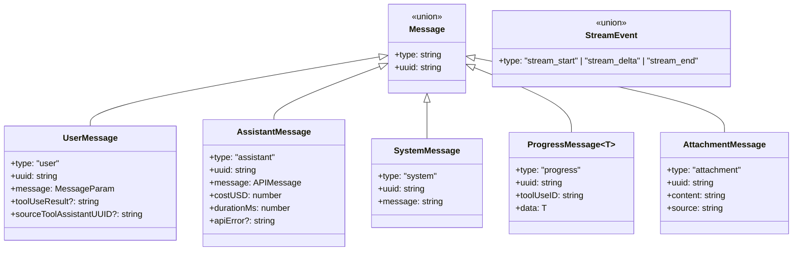
```mermaid
classDiagram
    class Message {
        <<union>>
        +type: string
        +uuid: string
    }

    class UserMessage {
        +type: "user"
        +uuid: string
        +message: MessageParam
        +toolUseResult?: string
        +sourceToolAssistantUUID?: string
    }

    class AssistantMessage {
        +type: "assistant"
        +uuid: string
        +message: APIMessage
        +costUSD: number
        +durationMs: number
        +apiError?: string
    }

    class SystemMessage {
        +type: "system"
        +uuid: string
        +message: string
    }

    class ProgressMessage~T~ {
        +type: "progress"
        +uuid: string
        +toolUseID: string
        +data: T
    }

    class AttachmentMessage {
        +type: "attachment"
        +uuid: string
        +content: string
        +source: string
    }

    class StreamEvent {
        <<union>>
        +type: "stream_start" | "stream_delta" | "stream_end"
    }

    Message <|-- UserMessage
    Message <|-- AssistantMessage
    Message <|-- SystemMessage
    Message <|-- ProgressMessage
    Message <|-- AttachmentMessage
```
